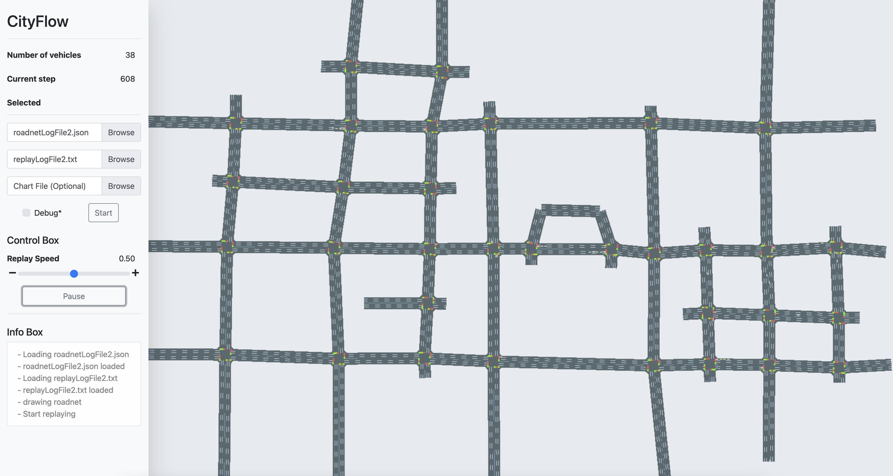
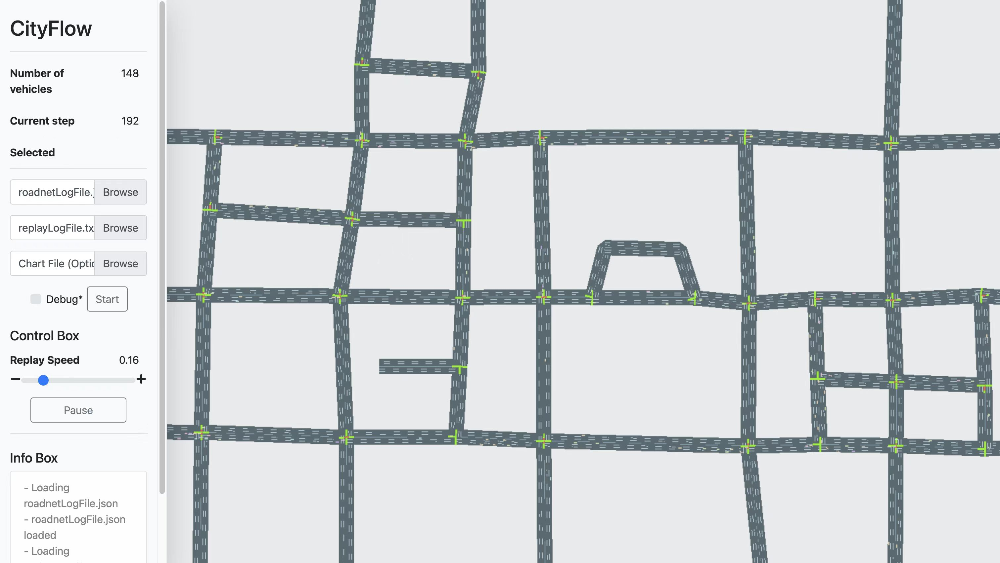
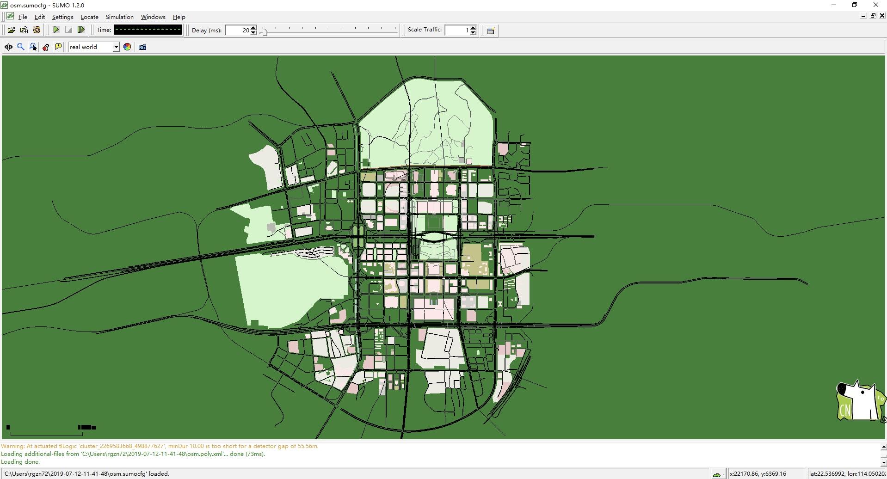
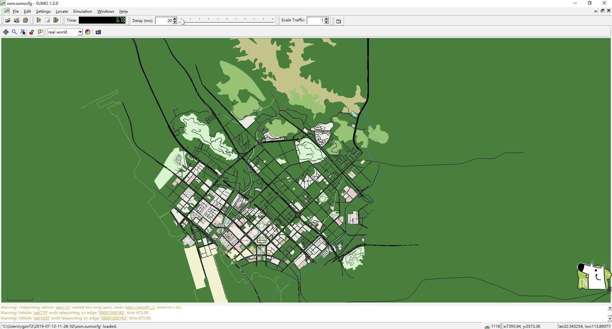
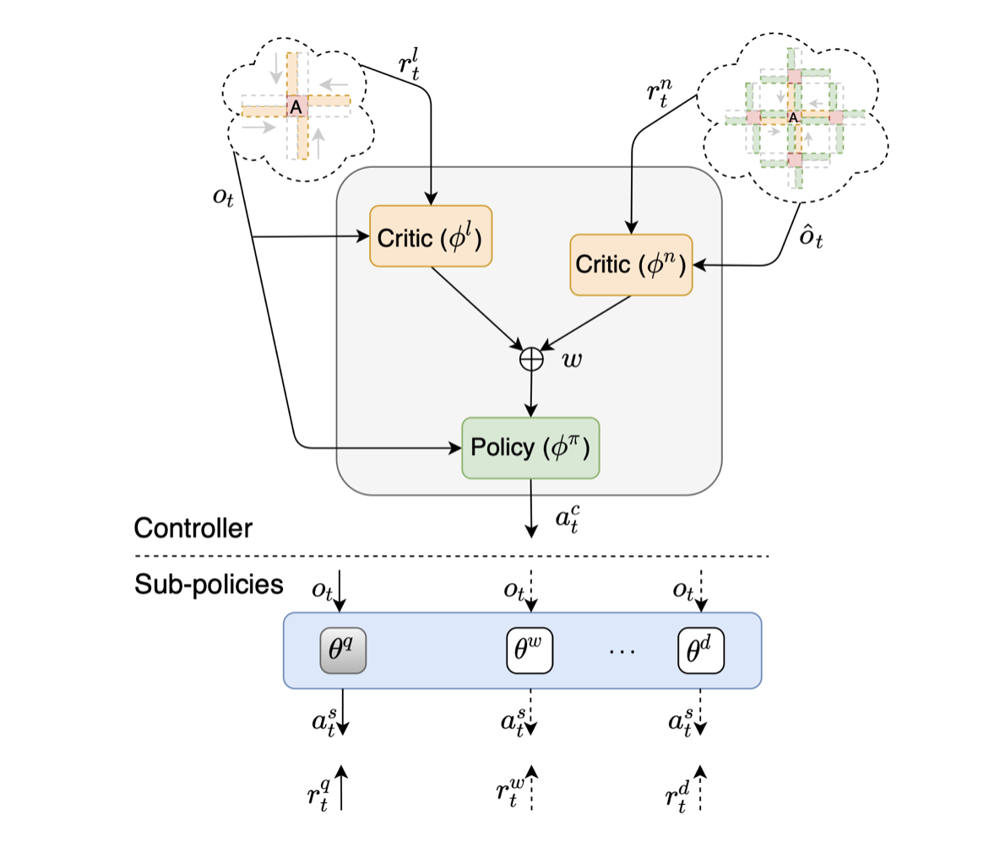
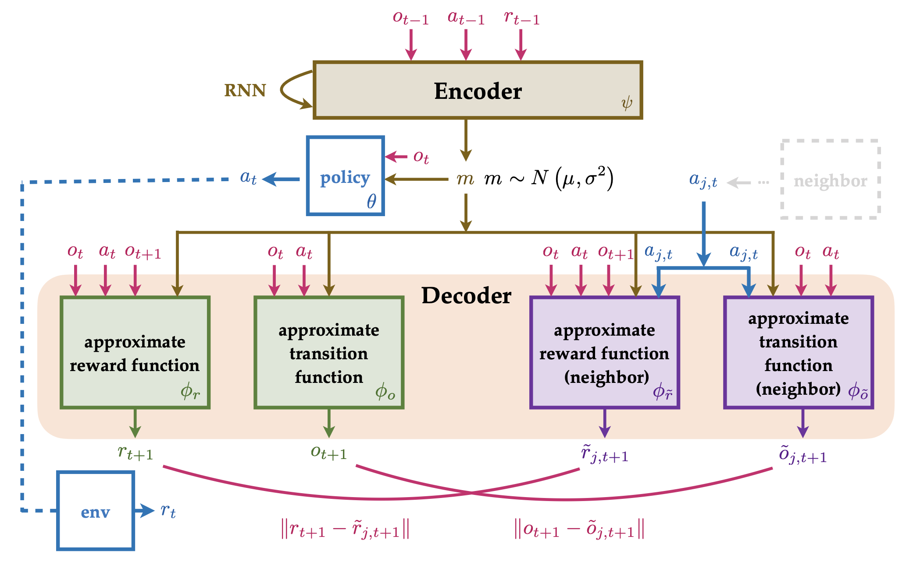

# PKU Traffic Lights

 

In this repository, we release the **Shenzhen** dataset and code for multi-agent traffic signal control.

- **Dataset**. We provide two versions that can run on both [SUMO](http://sumo.dlr.de/index.html) and [CityFlow](https://github.com/cityflow-project/CityFlow) platforms.
- **Code**. We provide three RL-based methods as baselines.

## Table of contents

- [PKU Traffic Lights](#pku-traffic-lights)
  - [Table of contents](#table-of-contents)
  - [Open Datasets](#open-datasets)
  - [Code list](#code-list)
  - [Cite](#cite)

## Open Datasets

| #    | Platform | Figure                      | Dataset                                                      |
| ---- | -------- | --------------------------- | ------------------------------------------------------------ |
| 1    | CityFlow |       | **Roadnet**:<br> [roadnet_1_33.json](./data_cityflow/roadnet_1_33.json) <br>**Flow**:<br>[anon_1_33_fuhua_24hto1w_2490.json](./data_cityflow/anon_1_33_fuhua_24hto1w_2490.json)<br>[anon_1_33_fuhua_4_27_24hto1w_4089.json](./data_cityflow/anon_1_33_fuhua_4_27_24hto1w_4089.json)<br> |
| 2    | CityFlow |       | **Roadnet**:<br> [fuhua_cityflow.json](./data_cityflow/fuhua_cityflow.json) <br>**Flow**:<br>[fuhua_real_1775.json](./data_cityflow/fuhua_real_1775.json)<br>[fuhua_2570.json](./data_cityflow/fuhua_2570.json)<br>[fuhua_4770.json](./data_cityflow/fuhua_4770.json) |
| 3    | SUMO     |  | [FuTian.net.xml](./data_sumo/FuTian.net.xml)<br>[FuTian.edg.xml](./data_sumo/FuTian.edg.xml)<br>[FuTian.nod.xml](./data_sumo/FuTian.nod.xml)<br>[FuTian.tll.xml](./data_sumo/FuTian.tll.xml)<br>[FuTian.typ.xml](./data_sumo/FuTian.typ.xml)<br>[FuTian.con.xml](./data_sumo/FuTian.con.xml)<br> |
| 4    | SUMO     |   | [BaoAn.net.xml](./data_sumo/BaoAn.net.xml)<br>[BaoAn.edg.xml](./data_sumo/BaoAn.edg.xml)<br>[BaoAn.nod.xml](./data_sumo/BaoAn.nod.xml)<br>[BaoAn.tll.xml](./data_sumo/BaoAn.tll.xml)<br>[BaoAn.typ.xml](./data_sumo/BaoAn.typ.xml)<br>[BaoAn.con.xml](./data_sumo/BaoAn.con.xml)<br> |

## Code list

| #    | Title                                                        | Figure                  | Code                   | Tutorial                             |
| ---- | ------------------------------------------------------------ | ----------------------- | ---------------------- | ------------------------------------ |
| 1    | Hierarchically and Cooperatively Learning Traffic Signal Control |  | [code](./code/HiLight) | [tutorial](./code/HiLight/README.md) |
| 2    | MetaVIM: Meta Variationally Intrinsic Motivated Reinforcement Learning for Decentralized Traffic Signal Control |  | [code](./code/MetaVIM) | [tutorial](./code/MetaVIMREADME.md)  |
| 3    | LToS                                                         |                         | [code](./code/LToS)    | [tutorial](./code/LToS/README.md)    |


## Cite

If you use Shenzhen Dataset in your work, please cite it as follows:

```
@misc{RoadnetSZ,
	title = {RoadnetSZ},
	author = {Bingyu, Xu and Liwen, Zhu and Yuxuan, Yi and Zongqing, Lu and other contributors},
	year = {2022},
	howpublished = {\url{https://github.com/zhuliwen/PKU_Traffic_Lights}},
	note = {Accessed: 2022-05-01},
}
```