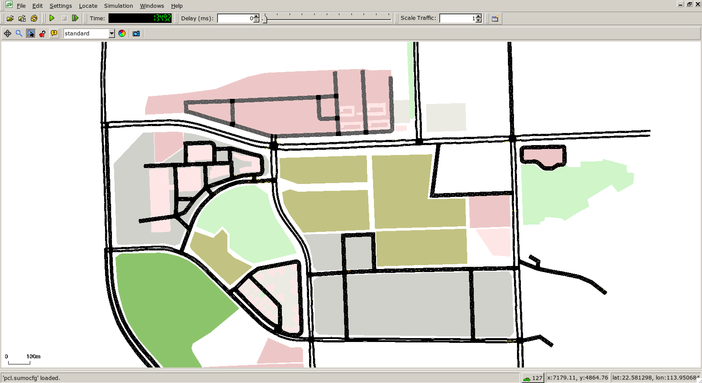
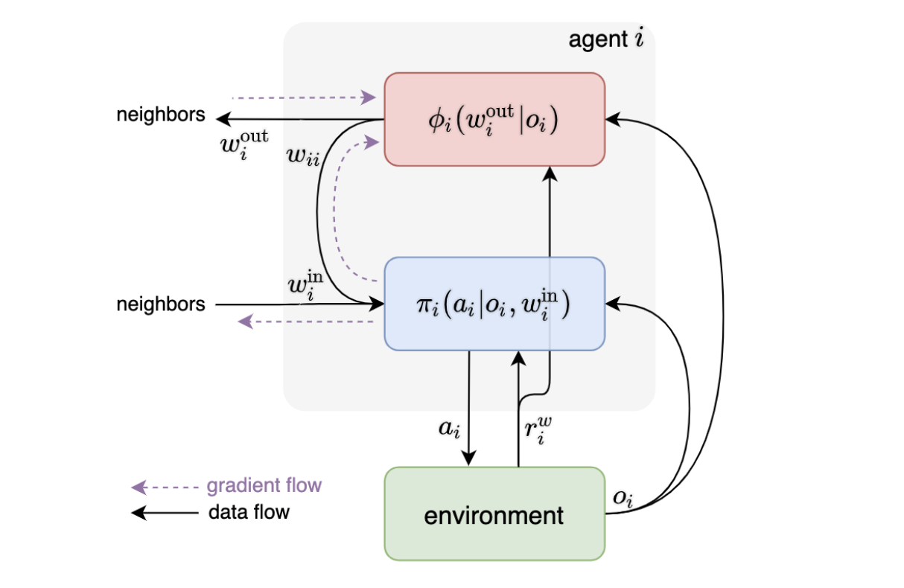

# RoadnetSZ: Road networks and traffic flows in Shenzhen

 

In this repository, we release the **Shenzhen** dataset and code for multi-agent traffic signal control.

- **Dataset**. We provide two versions that can run on both [SUMO](http://sumo.dlr.de/index.html) and [CityFlow](https://github.com/cityflow-project/CityFlow) platforms.
- **Code**. We provide three RL-based methods as baselines.

## Table of contents

- [RoadnetSZ: Road networks and traffic flows in Shenzhen](#roadnetsz-road-networks-and-traffic-flows-in-shenzhen)
  - [Table of contents](#table-of-contents)
  - [Open Datasets](#open-datasets)
  - [Code list](#code-list)
  - [Cite](#cite)

## Open Datasets

| #    | Name     | Platform | Figure                      | Dataset                                                      |
| ---- | -------- | -------- | --------------------------- | ------------------------------------------------------------ |
| 1    | Fuhua (hilight)      | CityFlow |       | **Roadnet**:<br> [roadnet_1_33.json](./data_cityflow/roadnet_1_33.json) <br>**Flow**:<br>[anon_1_33_fuhua_24hto1w_2490.json](./data_cityflow/anon_1_33_fuhua_24hto1w_2490.json)<br>[anon_1_33_fuhua_4_27_24hto1w_4089.json](./data_cityflow/anon_1_33_fuhua_4_27_24hto1w_4089.json)<br> |
| 2    | Fuhua (metavim)         | CityFlow |       | **Roadnet**:<br> [fuhua_cityflow.json](./data_cityflow/fuhua_cityflow.json) <br>**Flow**:<br>[fuhua_real_1775.json](./data_cityflow/fuhua_real_1775.json)<br>[fuhua_2570.json](./data_cityflow/fuhua_2570.json)<br>[fuhua_4770.json](./data_cityflow/fuhua_4770.json) |
| 3    | FuTian         | SUMO     |  | [FuTian.net.xml](./data_sumo/FuTian.net.xml)<br>[FuTian.edg.xml](./data_sumo/FuTian.edg.xml)<br>[FuTian.nod.xml](./data_sumo/FuTian.nod.xml)<br>[FuTian.tll.xml](./data_sumo/FuTian.tll.xml)<br>[FuTian.typ.xml](./data_sumo/FuTian.typ.xml)<br>[FuTian.con.xml](./data_sumo/FuTian.con.xml)<br> |
| 4    | BaoAn         | SUMO     |   | [BaoAn.net.xml](./data_sumo/BaoAn.net.xml)<br>[BaoAn.edg.xml](./data_sumo/BaoAn.edg.xml)<br>[BaoAn.nod.xml](./data_sumo/BaoAn.nod.xml)<br>[BaoAn.tll.xml](./data_sumo/BaoAn.tll.xml)<br>[BaoAn.typ.xml](./data_sumo/BaoAn.typ.xml)<br>[BaoAn.con.xml](./data_sumo/BaoAn.con.xml)<br> |
| 5    | PCL         | SUMO     |   | [pcl.net.xml](./data_sumo/pcl.net.xml)<br>[pcl.edg.xml](./data_sumo/pcl.edg.xml)<br>[pcl.nod.xml](./data_sumo/pcl.nod.xml)<br>[pcl.tll.xml](./data_sumo/pcl.tll.xml)<br>[pcl.typ.xml](./data_sumo/pcl.typ.xml)<br>[pcl.con.xml](./data_sumo/pcl.con.xml)<br>[pcl.trips.xml](./data_sumo/pcl.trips.xml)<br>[pcl.sumocfg](./data_sumo/pcl.sumocfg)<br> |

## Code list

| #    | Title                                                        | Figure                  | Code                   | Tutorial                             |
| ---- | ------------------------------------------------------------ | ----------------------- | ---------------------- | ------------------------------------ |
| 1    | [Hierarchically and Cooperatively Learning Traffic Signal Control](https://z0ngqing.github.io/paper/aaai-bingyu21.pdf) |  | [code](./code/HiLight) | [tutorial](./code/HiLight/README.md) |
| 2    | [MetaVIM: Meta Variationally Intrinsic Motivated Reinforcement Learning for Decentralized Traffic Signal Control](https://arxiv.org/pdf/2101.00746.pdf) |  | [code](./code/MetaVIM) | [tutorial](./code/MetaVIM/README.md)  |
| 3    | [Learning To Share In Multi-Agent Reinforcement Learning](https://openreview.net/pdf?id=awnQ2qTLSwn) |  | [code](./code/LToS)    | [tutorial](./code/LToS/README.md)    |


## Cite

If you use Shenzhen Dataset in your work, please cite it as follows:

```
@misc{RoadnetSZ,
	title = {RoadnetSZ},
	author = {Bingyu, Xu and Liwen, Zhu and Yuxuan, Yi and Zongqing, Lu and other contributors},
	year = {2022},
	howpublished = {\url{https://github.com/zhuliwen/PKU_Traffic_Lights}},
	note = {Accessed: 2022-05-01},
}

@article{zhu2023metavim,
  title={Metavim: Meta variationally intrinsic motivated reinforcement learning for decentralized traffic signal control},
  author={Zhu, Liwen and Peng, Peixi and Lu, Zongqing and Tian, Yonghong},
  journal={IEEE Transactions on Knowledge and Data Engineering},
  year={2023},
  publisher={IEEE}
}

@inproceedings{xu2021hierarchically,
  title={Hierarchically and cooperatively learning traffic signal control},
  author={Xu, Bingyu and Wang, Yaowei and Wang, Zhaozhi and Jia, Huizhu and Lu, Zongqing},
  booktitle={Proceedings of the AAAI Conference on Artificial Intelligence},
  volume={35},
  number={1},
  pages={669--677},
  year={2021}
}

@article{yi2021learning,
  title={Learning to Share in Multi-Agent Reinforcement Learning},
  author={Yi, Yuxuan and Li, Ge and Wang, Yaowei and Lu, Zongqing},
  journal={arXiv preprint arXiv:2112.08702},
  year={2021}
}
```
